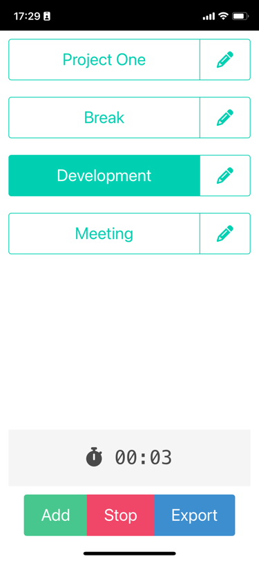

# TimeTapper.nl

A simple app I made because I couldn't be bothered to remember what I did today.

This app keeps your phone screen alive and allows you to tap an activity to log time.
Then export a .csv file for data entry later.

The app works best installed as a PWA.

1. Enter your common tasks using the "Add" button
2. Tap a task to start it or "Stop" to take a break
3. Hit "Export" to clear your history and save your .csv export somewhere
4. Repeat

## Screenshot

